# This writeup is for the crackme "Maze by LvHa"

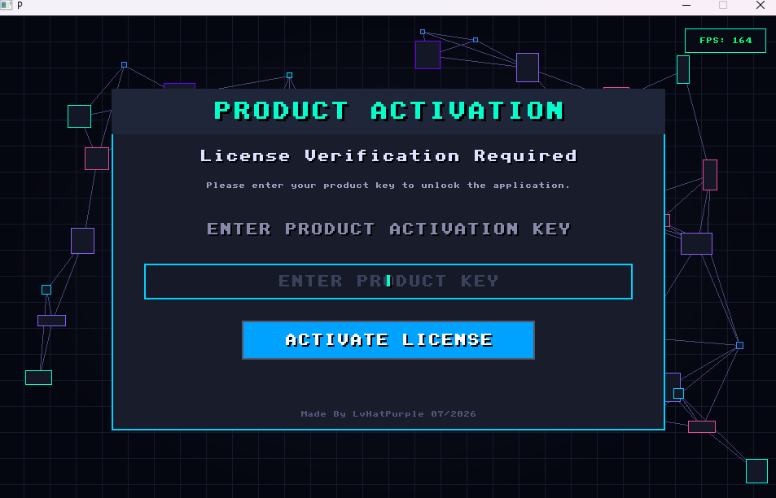

The goal is to get the flag

It contains Anti-debugging, String/data encryption, runtime decrypt, Code Virtualization, Import Api obfuscation.

- The PE doesn't have a import table.
First it call function at offset 0x518AD that decrypts the code in offset 0x1000. The whole decryption logic is obfuscated using Code Vitualization.
I wrote a dissassmbler to deobfuscate the virtualized code to look out where the decrypted code is stored.

  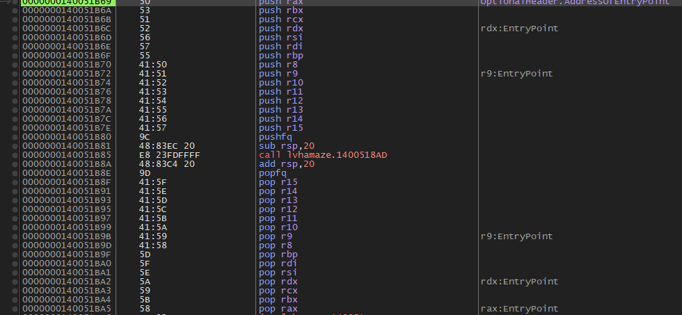

- below is the screenshot of the deobfuscated virtualized code that decrypts the code in offset 0x1000
- 
  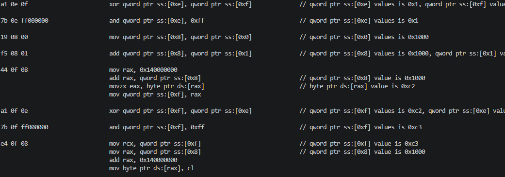

- Then at offset 0x5172A it calls a function that decrypts table containing dll names to stack.
Then loads all the dll using LdrLoadDll function and store all the dlls base address as table in data section offset 0x53360.

  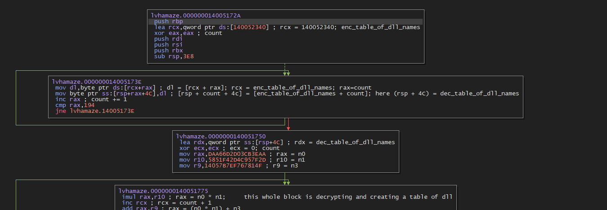

  decrypted table containing dll names
  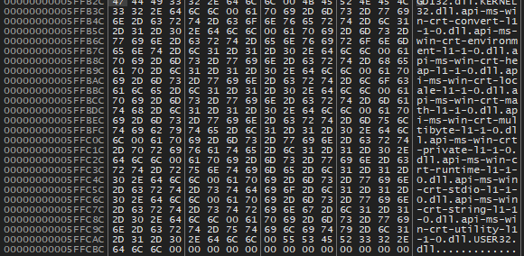
  

- Next it resolves the imported dlls function of the decrypted code at offset 0x1000. To resolve it use a struct table which is in offset 0x53360. 
   
  ```C
  struct{
    dword dll_base_address_table_index // dll_base_address_table in offset 0x53360 
    dword function_hash
    dword function_rva
  }
  
  ```

  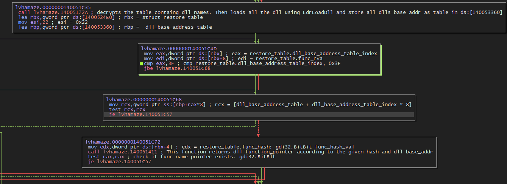

- After that it changes the first 0x1000 bytes to rwx and clears all headers data except dos message and magic number

  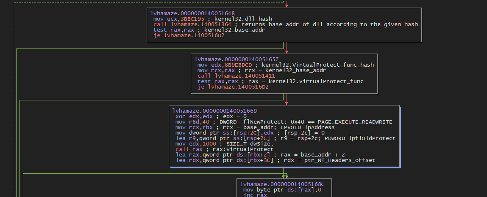
  
  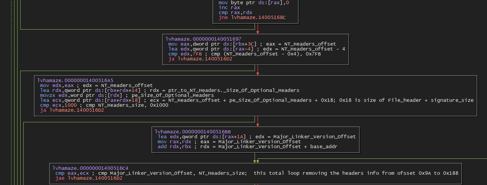

- Then it creates a thread of function at offset 0x516D8.
This thread function checks whether its being debugged. It contains a loop of 0xfffff and again checks is it being debugged. If it is being debugged then it jumps to a illegal instruction which cause EXCEPTION_ILLEGAL_INSTRUCTION.
So patch the thread creation or kill the thread

  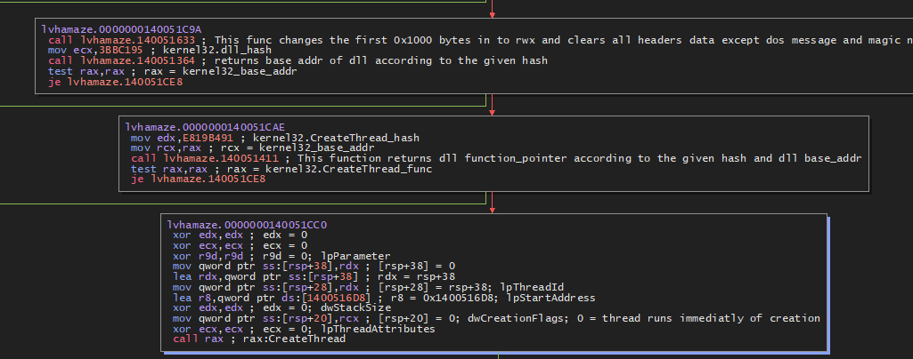

- Even after the thread creation there is two time check for being debugged by the function at offset 0x515A8, 0x515D5.
- just patch it on memory or change return value eax = 0.

  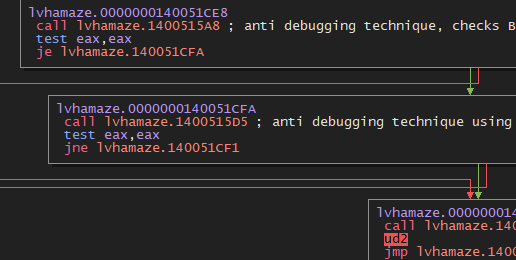

- Then it finally jumps to the decrypted code af offset 0x13D0 which is the original entry point.
  Here it calls the c runtime.

  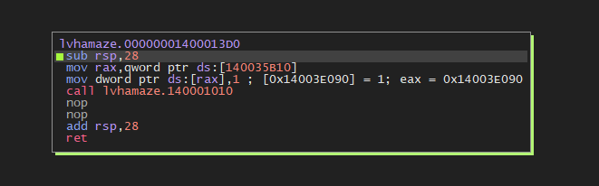

- The main funciton is at offset 0x4980 and the function that validates the serial key is at offset 0x19C80

  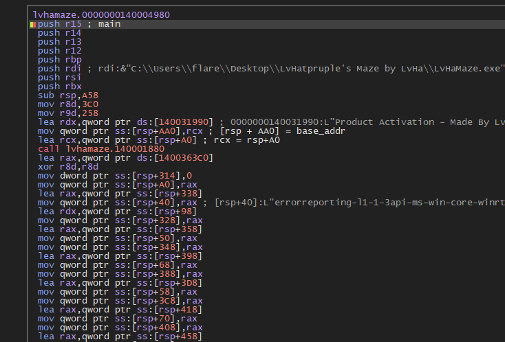

  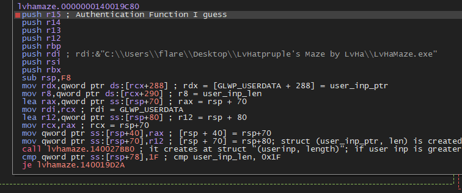

- The function first check is the user input string is 31 bytes else it exits with a Activation failed
  
  

  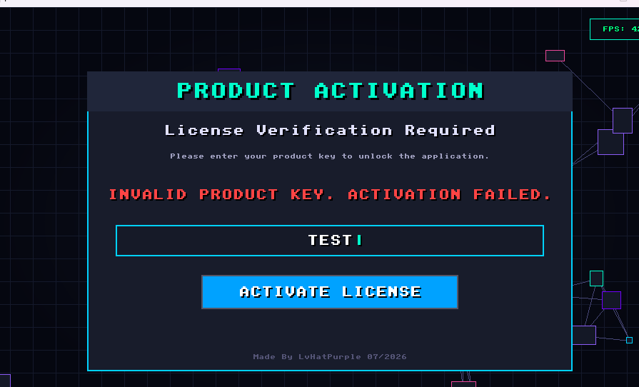

- Then it converts the user input to uppercase and strip spaces
- It divides the userinput key into 4 parts and packs it. First 3 parts are 8 bytes and the last part is 7 bytes.

  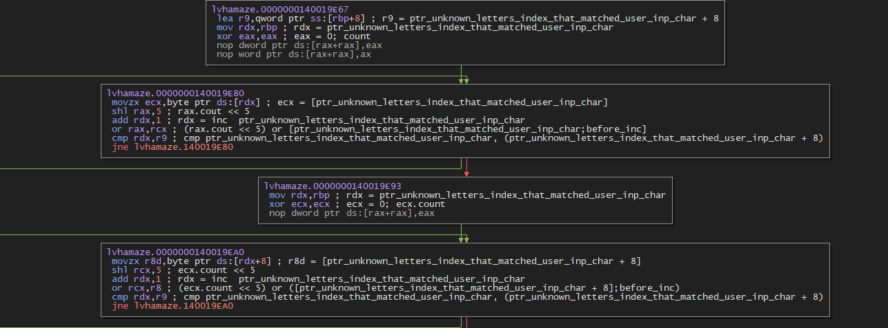

  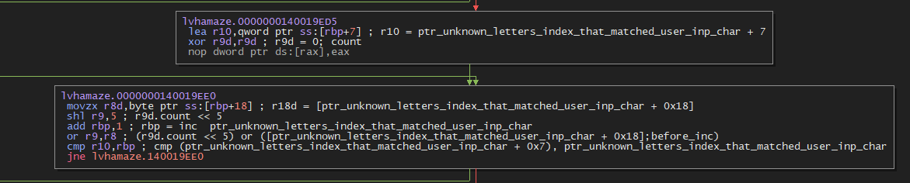

- Then it unpacks the first 8 bytes and goes through obfuscated calculation and check whether it's result is less than 0x0204081020408101

  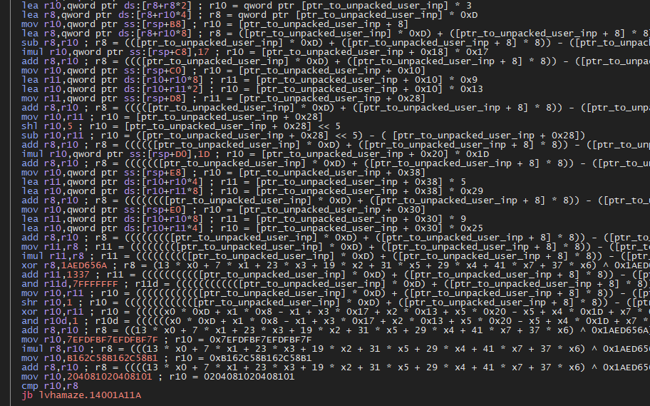

- if it success than it takes the first 8 bytes of packed input serial key and again goes through a obfuscated calculation and checks for against the last 3 parts of the packed input serial key.

  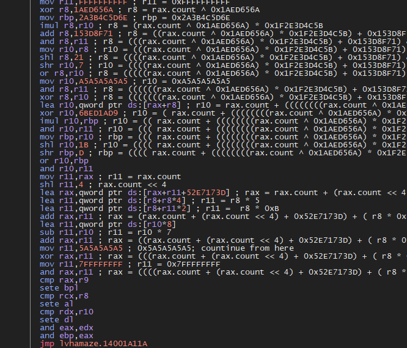

- if it satisfies then the register bpl will be 1.
- Then it creates a hash using the user input serial key. That hash is used to generate random numbers of 0x490 bytes

  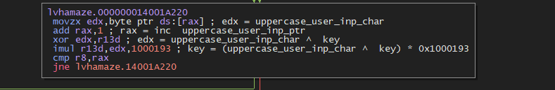

  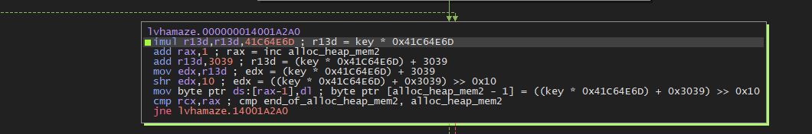

- This random numbers of 0x490 bytes is used to decrypt the 0x490 bytes in offset 0x31AE0 using XOR.

  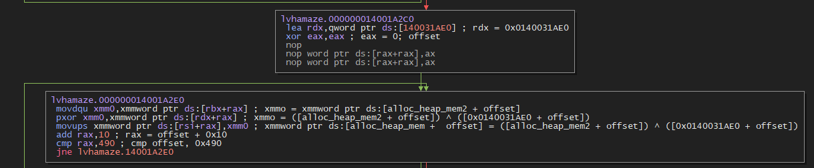

- Then it checks if bpl is 1 and the decrypted first 4 bytes of 0x490 bytes is equal to 0x4D415A45
- If it fails then it write OxCAFEBABE to address of your (decrypted first 4 byte XOR 0xDEADBEEF) which cause access violation and crashed the application.

  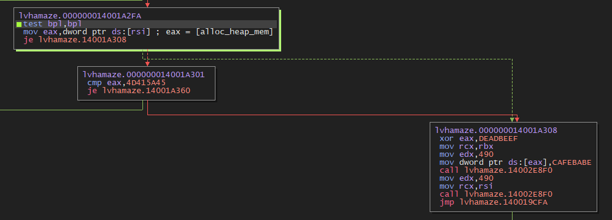

- If success it shows license activated success. Then you need to play the maze and find green door in any difficulty to get the flag.

  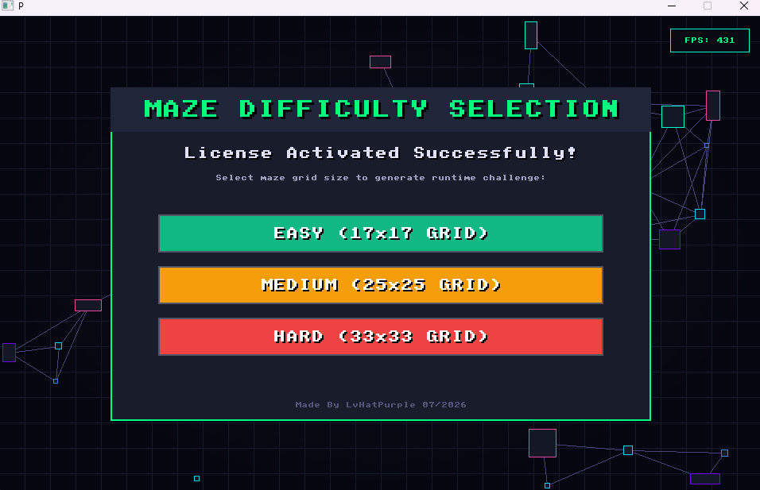

  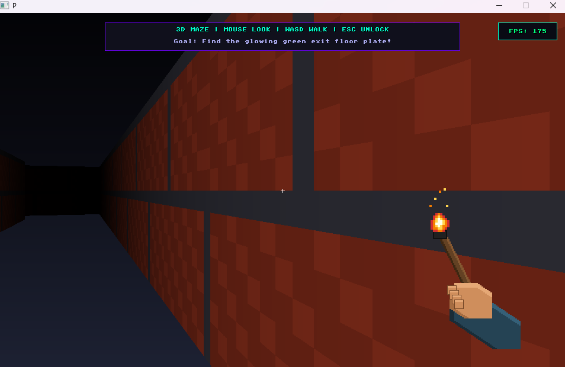

  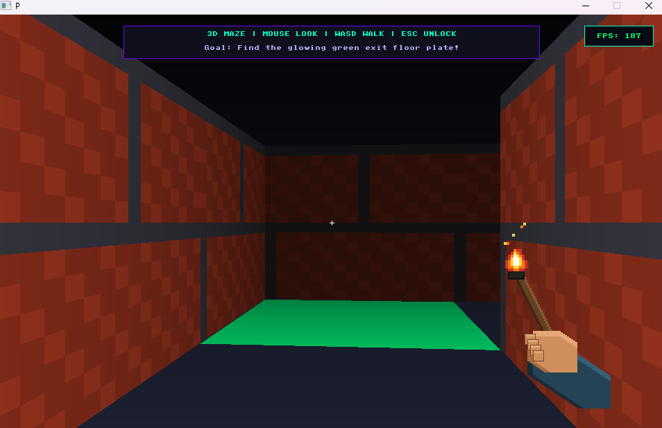

  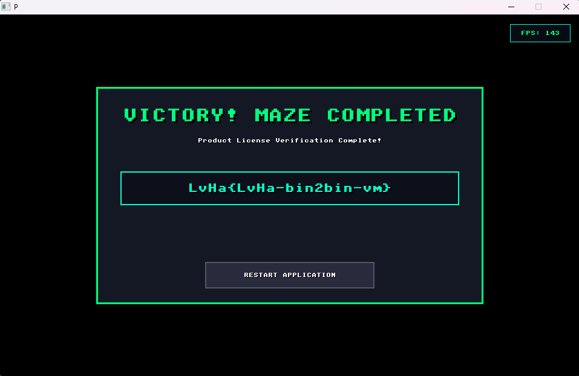

- I created a keygen using z3 which satisfy all the condition but it takes too much time to generate key.
  So i modified the keygen to satisfy only the last condition i.e (decrypted first 4 bytes of 0x490 bytes is equal to 0x4D415A45) and patched the other conditions in memory for success license activation.
  And play the maze to get the flag

  Note: If you patch all the condition then flag will be scrambled.
  
